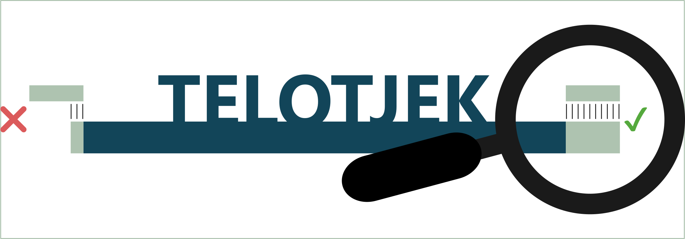

# Telotjek
<p align="center">
  
</p>

Should you manually inspect the ends of your Streptomycete assembly? If you can not idenitfy a telomere at both ends of a linear replicon the answer is yes.

Telotjek provides a quick and dirty way to approach this check. It runs BLAST-searches against a representative of the 129 telomere clusters generated in Faurdal et al. 2025 [1] or a representative of the six classes outlined in Algora-Gallardo et al 2021 [2] and reports if it matches any of the classes and if it is present in full or truncated. If you do not have a match in your otherwise *complete* assembly you should consider checking if the reads support extending it further [1] or if you have a potentially novel telomere class on your hands.

## Usage

### Basic usage:
```
telotjek assembly.fasta
```
This runs a search against a representative of the 129 streptomycete clusters outlined in [1]. 
A match is reported as full if the terminal 90 nucleotides (±3 nt tolerance) of the representative are present. Truncatations are based the approximate positions missing from the reference terminus:

- Missing the first 13 nt → "Truncated; missing palindrome I"
- Missing up to ~40 nt → "Truncated; missing palindrome I and II"
- Missing up to ~65 nt → "Truncated; missing palindrome I, II, and III"
- Missing up to ~100 nt → "Truncated; missing palindrome I, II, and IV"
- Missing up to ~40 nt → "Truncated; missing palindrome I and II"
- Missing up to ~65 nt → "Truncated; missing palindrome I, II, and III"
- Missing up to ~100 nt → "Truncated; missing palindrome I, II, and IV"
- Mssing 100+: "No Match"

An example against an edited assembly of Streptomyces coelicolor A3(2):
```
Contig  Side    Class   Coverage
Streptomyces_coelicolor_A3(2)   left    cluster_2_AF038453.1_left       Full
Streptomyces_coelicolor_A3(2)   right   cluster_2_AF038453.1_left       Full
Streptomyces_coelicolor_A3_L_trunc10_R_deleted  left    cluster_2_AF038453.1_left       Truncated; missing palindrome I
Streptomyces_coelicolor_A3_L_trunc10_R_deleted  right           No match
```

### Telomer classes
To use the 6 representatives outlined by Algora-Gallardo et al 2021 [2] rather than the telomere clusters:
```
telotjek assembly.fasta --telo_class
```

### Useful options
To get information about the BLAST matches using ```--full-table```


## Installation
The easiest way to install telotjek is via pip

```
pip install telotjek
```

## Dependencies
Requires blast

## Source:
1. Faurdal D, Booth TJ, Weber T, Jørgensen TS. Tying up loose ends: recovering thousands of missing telomeres from Streptomyces and other Streptomycetaceae genomes. bioRxiv [Preprint]. 2025 Oct 14:2025.10.14.682034. doi:10.1101/2025.10.14.682034.
2. Algora-Gallardo L, Schniete JK, Mark DR, Hunter IS, Herron PR. Bilateral symmetry of linear streptomycete chromosomes. Microb Genom. 2021 Nov;7(11):000692. doi: 10.1099/mgen.0.000692. PMID: 34779763; PMCID: PMC8743542.
